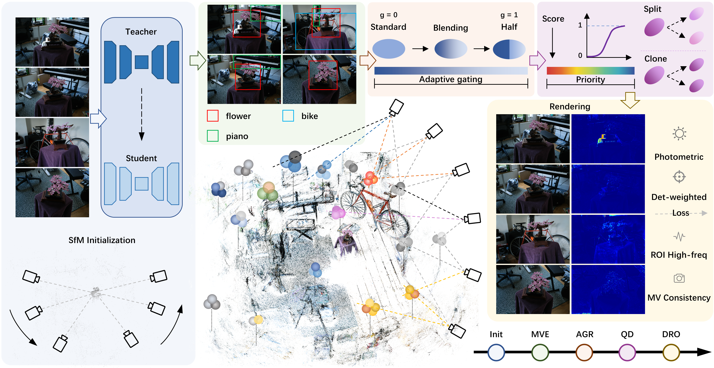

# DAGS: Detection-Guided Adaptive Gaussian Splatting for 3D Reconstruction and Rendering

Official implementation of **DAGS**, a detection-guided Gaussian Splatting framework for object-aware fine-grained 3D reconstruction and novel-view synthesis.

<p align="center">
  
</p>

<p align="center">
  <b>Overview of the DAGS framework.</b>
</p>

DAGS lifts multi-view 2D detections into persistent Gaussian-level evidence and uses this evidence to jointly guide adaptive Gaussian representation, quality-aware densification, and detection-aware reconstruction optimization.

## Overview

The complete DAGS pipeline consists of:

1. **Interactive annotation** of a small number of training images.
2. **Semi-supervised Teacher-Student detection** based on YOLO26s to generate detections for all training views.
3. **Multi-view Detection Evidence (MVE)** to lift view-wise detections into persistent Gaussian-level evidence.
4. **Adaptive Gaussian Representation (AGR)** to continuously regulate standard Gaussian and Half-Gaussian responses.
5. **Quality-aware Densification (QD)** to prioritize target and under-reconstructed regions.
6. **Detection-aware Reconstruction Optimization (DRO)** with detection-weighted reconstruction, ROI high-frequency supervision, and multi-view consistency.
7. **Rendering and evaluation** using PSNR, SSIM, and LPIPS.

The recommended entry point is `run_pipeline.py`, which connects annotation, semi-supervised detection, and DAGS reconstruction in a single workflow.

---

## Installation

### 1. Clone the repository

```bash
git clone --recursive https://github.com/guiwangAI/DAGS.git
cd DAGS
```

If the repository has already been cloned without submodules:

```bash
git submodule update --init --recursive
```

### 2. Create the Conda environment

The provided `environment.yaml` contains the environment used by DAGS, including:

- Python 3.8.20
- PyTorch 2.0.1 + CUDA 11.8
- torchvision 0.15.2 + CUDA 11.8
- torchaudio 2.0.2 + CUDA 11.8
- NumPy 1.24.4
- SciPy 1.10.1
- Ultralytics 8.4.100
- OpenCV 4.8.1.78
- LPIPS 0.1.4
- TensorBoard 2.14.0
- CMake 3.25.0

Create the environment from the repository root:

```bash
conda env create -f environment.yaml
conda activate dags
```

The environment installs the following local extensions:

```text
submodules/diff-gaussian-rasterization
submodules/simple-knn
submodules/fused-ssim
```

Therefore, make sure the repository is cloned with all submodules before creating the environment.

---

## Dataset Preparation

DAGS follows the standard 3DGS/COLMAP scene organization:

```text
scene/
├── images/
└── sparse/
    └── 0/
        ├── cameras.bin
        ├── images.bin
        └── points3D.bin
```

If COLMAP reconstruction has already been generated, the scene can be used directly.

For raw images, the standard conversion script can be used:

```bash
python convert.py -s /path/to/scene
```

The standard conversion pipeline expects the original images under:

```text
/path/to/scene/input/
```

COLMAP should be installed separately and available from the command line.

---

## Quick Start

The recommended way to run the complete DAGS pipeline is:

```bash
python run_pipeline.py \
    --scene /path/to/scene \
    --output /path/to/output \
    --eval
```

Windows example:

```bash
python run_pipeline.py --scene D:\data\scene --output D:\output\scene --eval
```

By default, DAGS uses a single detection class named `target`.

If `--annotate-images` is not specified, the program allows the user to select images for manual annotation and then opens the **DAGS Interactive YOLO Annotator**.

---

## Interactive Annotation

Images for manual annotation can be explicitly specified:

```bash
python run_pipeline.py \
    --scene /path/to/scene \
    --output /path/to/output \
    --annotate-images image_001.jpg image_020.jpg image_045.jpg \
    --class-names target \
    --eval
```

Annotation controls:

| Operation | Control |
|---|---|
| Draw bounding box | Hold and drag the left mouse button |
| Select class | Number keys `0`-`9` |
| Undo last box | `u` |
| Save current image | `s` |
| Next image | `n` |
| Previous image | `p` |
| Finish annotation | `q` or `Esc` |

Human annotations are stored in:

```text
scene/detector_workspace/human_labels/
```

The original training images are not modified.

---

## Multi-Class Detection

Multiple object classes can be specified using `--class-names`:

```bash
python run_pipeline.py \
    --scene /path/to/scene \
    --output /path/to/output \
    --class-names flower bicycle piano \
    --class-densify-weights 1.5,1.5,1.5 \
    --eval
```

The class order determines the YOLO class IDs:

```text
0 -> flower
1 -> bicycle
2 -> piano
```

---

## Semi-Supervised Detection

DAGS uses a round-wise Teacher-Student self-training pipeline.

The default configuration is:

```text
Pretrained detector       : yolo26s.pt
YOLO image size           : 640
Warm-up epochs            : 50
Semi-supervised rounds    : 3
Student epochs per round  : 50
Teacher EMA decay         : 0.8
```

The workflow is:

```text
Human annotations
        ↓
Teacher warm-up
        ↓
Teacher pseudo-label generation
        ↓
Student training with human + pseudo labels
        ↓
Round-wise EMA Teacher update
        ↓
Final Teacher prediction
        ↓
Detection labels for all training views
```

The final per-view detection labels are written to:

```text
scene/det_labels/
```

The detector workspace is stored under:

```text
scene/detector_workspace/
```

---

## Reusing Existing Annotations

If manual labels already exist in:

```text
scene/detector_workspace/human_labels/
```

the interactive annotation stage can be skipped:

```bash
python run_pipeline.py \
    --scene /path/to/scene \
    --output /path/to/output \
    --skip-annotation \
    --eval
```

---

## Reusing Existing Detection Labels

If final detection labels already exist in:

```text
scene/det_labels/
```

the detector stages can be skipped:

```bash
python run_pipeline.py \
    --scene /path/to/scene \
    --output /path/to/output \
    --skip-annotation \
    --skip-warmup \
    --skip-semi \
    --skip-final-predict \
    --eval
```

This directly starts DAGS reconstruction using the existing detection labels.

---

## DAGS Reconstruction

The default reconstruction is trained for **30,000 iterations**.

Important default settings include:

| Parameter | Default |
|---|---:|
| Training iterations | 30,000 |
| SSIM weight | 0.2 |
| Evidence views per update | 48 |
| Evidence update interval | 2,000 |
| Evidence EMA decay | 0.70 |
| Gate threshold $\tau_g$ | 0.95 |
| Gate temperature $T_g$ | 0.25 |
| Gate sharpening factor $\kappa$ | 1.5 |
| Maximum densification weight $s_{\max}$ | 1.55 |
| HF loss weight | 0.01 |
| MV loss weight | 0.002 |
| MV start iteration | 6,000 |

The complete pipeline automatically passes the required DAGS settings to `train.py`.

If detection labels have already been generated, reconstruction can also be launched directly with `train.py`. The DAGS-specific arguments use the `--dags_*` prefix in the cleaned release.

Example:

```bash
python train.py \
    -s /path/to/scene \
    -m /path/to/output \
    --eval \
    --dags_enable \
    --det_label_dirs /path/to/scene/det_labels \
    --dags_num_classes 1 \
    --dags_class_densify_weights 1.5 \
    --dags_gate_threshold 0.95 \
    --dags_gate_temperature 0.25 \
    --dags_gate_sharpen 1.5 \
    --dags_densify_weight_max 1.55
```

---

## Rendering

After training, render the reconstructed scene with:

```bash
python render.py -m /path/to/output
```

To render only the test views:

```bash
python render.py -m /path/to/output --skip_train
```

To load a specific iteration:

```bash
python render.py -m /path/to/output --iteration 30000
```

---

## Evaluation

After rendering the test views:

```bash
python metrics.py -m /path/to/output
```

The evaluation reports:

- PSNR
- SSIM
- LPIPS

---

## Project Structure

```text
DAGS/
├── train.py
├── render.py
├── metrics.py
├── run_pipeline.py
├── convert.py
├── environment.yaml
├── LICENSE.md
├── README.md
│
├── assets/
│   └── overview.png
│
├── arguments/
├── gaussian_renderer/
├── scene/
├── utils/
│   └── dags_controller.py
│
├── tools/
│   ├── interactive_annotator.py
│   └── semi_supervised_detector.py
│
├── lpipsPyTorch/
│
└── submodules/
    ├── diff-gaussian-rasterization/
    ├── simple-knn/
    └── fused-ssim/
```

---

## Main Components

### Multi-view Detection Evidence

DAGS projects Gaussian centers into multiple training views and aggregates view-wise detection information into persistent Gaussian-level evidence. This evidence is used as a stable object prior throughout reconstruction.

### Adaptive Gaussian Representation

DAGS uses a continuous adaptive gate to regulate the transition between the standard Gaussian response and the Half-Gaussian response. Target boundaries and asymmetric structures can receive stronger Half-Gaussian behavior, while smooth regions retain standard Gaussian behavior.

### Quality-aware Densification

DAGS combines detection evidence, multi-view reliability, reconstruction residuals, and high-frequency responses to increase the densification priority of target and under-reconstructed regions while retaining the original background densification capability.

### Detection-aware Reconstruction Optimization

DAGS combines detection-weighted photometric reconstruction, ROI high-frequency supervision, and multi-view consistency to improve local object details and cross-view stability.

---

## Notes

- Detection labels are used as reconstruction guidance.
- The default detector is `yolo26s.pt`.
- The interactive annotation interface writes YOLO-format `.txt` labels.
- Keep the original image filenames unchanged after generating detection labels.
- Use the same train/test split and image resolution when comparing different reconstruction methods.

---

## Acknowledgements

DAGS is developed on top of the original 3D Gaussian Splatting codebase and uses Ultralytics YOLO for semi-supervised object detection.

Third-party components retain their original licenses.

---

## License

Please refer to `LICENSE.md` for the repository license and to the individual third-party directories for their corresponding licenses.
